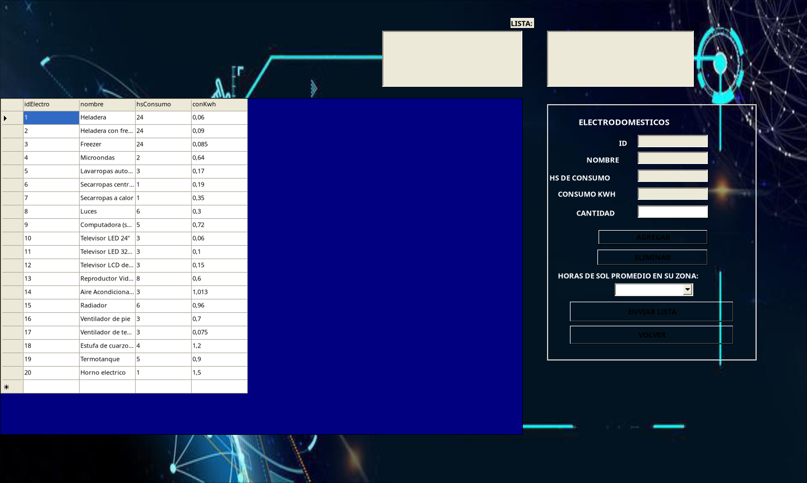

# SATER — Sistema de Asesoramiento Técnico en Energías Renovables

Aplicación de escritorio en **VB.NET / Windows Forms** que calcula el consumo eléctrico
de un hogar a partir de sus electrodomésticos y recomienda qué paneles solares —y
cuántos— hacen falta para cubrirlo.

La idea es bajar la barrera de entrada a la energía solar: en lugar de pedirle al
usuario que sepa cuántos watt-pico necesita, el sistema se lo deduce a partir de algo
que sí conoce (qué aparatos tiene en casa y cuántas horas los usa).

---

## Capturas

**Menú principal** — punto de entrada al cálculo y al mantenimiento de catálogos.


**Cálculo de consumo** — catálogo de electrodomésticos cargado desde la base, panel
de selección con cantidad y horas de sol, y las listas donde se arma el hogar.



> Capturas tomadas con la aplicación corriendo sobre Mono en Linux, con la base
> SQLite migrada desde el `.mdb` original.

---

## Características principales

- **Cálculo de consumo por hogar.** El usuario arma su lista de electrodomésticos
  eligiéndolos de un catálogo y declarando la cantidad de unidades de cada uno. El
  sistema acumula el consumo diario y lo proyecta a consumo anual.
- **Recomendación de paneles.** A partir del consumo diario, de las horas de sol
  útiles de la zona y de cuántos paneles se está dispuesto a instalar, calcula la
  potencia mínima en watt-pico por panel y filtra el catálogo mostrando solo los
  modelos que la alcanzan.
- **ABM de electrodomésticos.** Alta, búsqueda por ID o por nombre, modificación y
  baja, con validaciones de dominio (0 < horas ≤ 24, consumo > 0).
- **ABM de paneles solares.** Alta, búsqueda por ID o por tipo de panel,
  modificación y baja, validando que la eficiencia caiga en el rango 0–100 %.
- **Catálogo persistente.** Las dos tablas viven en una base de datos, así que el
  catálogo crece con el uso y no está cableado en el código.
- **Base de datos intercambiable.** Access/Jet en Windows, SQLite fuera de Windows,
  seleccionado automáticamente o forzado por configuración.

---

## Cómo funciona el cálculo

El motor del sistema son tres fórmulas encadenadas.

**1. Consumo diario del hogar** — se suma, por cada electrodoméstico de la lista:

```
consumo_diario [kWh/día] = Σ (unidades × horas_de_uso × consumo_por_hora [kWh])
consumo_anual  [kWh/año] = consumo_diario × 365
```

**2. Potencia media a sostener** — cuánta potencia habría que entregar de forma
continua para cubrir ese consumo:

```
potencia_media [W] = (consumo_diario × 1000) / 24
```

**3. Potencia mínima por panel** — el dato que realmente decide la compra. Los
paneles no producen las 24 h: solo durante las horas de sol útiles, así que toda la
energía del día tiene que generarse en esa ventana:

```
watt_pico_por_panel [Wp] = (consumo_diario × 1000) / horas_de_sol / cantidad_de_paneles
```

Con ese número el sistema consulta el catálogo:

```sql
SELECT * FROM paneles WHERE watts >= ? ORDER BY watts
```

### Ejemplo

Un hogar con heladera (24 h × 0,06 kWh), microondas (2 h × 0,64 kWh), lavarropas
(3 h × 0,17 kWh), 6 luces (6 h × 0,3 kWh) y una PC (5 h × 0,72 kWh):

| Concepto | Valor |
|---|---|
| Consumo diario | 1,44 + 1,28 + 0,51 + 10,80 + 3,60 = **17,63 kWh/día** |
| Consumo anual | **6.434,95 kWh/año** |
| Potencia media | **734,58 W** |
| Con 5 h de sol y 4 paneles | 17,63 × 1000 / 5 / 4 = **881,5 Wp por panel** |

---

## Recorrido por el sistema

### 1. Menú principal (`inicio`)

Punto de entrada. Un botón *EMPEZAR* lleva al flujo de cálculo, y una barra de menú
da acceso al mantenimiento de los dos catálogos (ELECTRODOMÉSTICOS → NUEVO /
MODIFICAR, PANELES → NUEVO / MODIFICAR).

### 2. Cálculo de consumo (`calcularConsumo`)

La pantalla central. Muestra el catálogo de electrodomésticos en una grilla; al
hacer clic en una fila se cargan sus datos de consumo. El usuario indica la cantidad
de unidades y presiona *AGREGAR*, que suma el ítem a tres listas paralelas
(electrodoméstico / cantidad / consumo). También elige las **horas de sol promedio**
de su zona. Al confirmar, calcula el consumo diario y anual y abre la recomendación.

### 3. Recomendación (`recomendacion`)

Recibe el consumo y las horas de sol. Muestra consumo diario, anual y la potencia
media a sostener, junto al catálogo completo de paneles. El usuario elige cuántos
paneles quiere instalar y presiona *GENERAR*: la grilla queda filtrada con los
modelos que alcanzan los watt-pico necesarios, ordenados de menor a mayor. Al
seleccionar uno se ven sus especificaciones completas.

### 4. Alta de catálogos (`agregarelectro`, `agregarpanel`)

Formularios de carga con la grilla del catálogo debajo, que se refresca tras cada
alta. Validan campos obligatorios, rangos de dominio y tipos numéricos.

### 5. Mantenimiento de catálogos (`opcioneselectro`, `opcionespanel`)

Búsqueda por ID o por texto (los dos filtros se autoexcluyen), edición bloqueada
hasta presionar *MODIFICAR*, y baja con confirmación.

---

## Modelo de datos

Dos tablas, sin relación entre sí: son catálogos independientes que el motor de
recomendación cruza en memoria.

**`electro`** — catálogo de electrodomésticos

| Campo | Tipo | Descripción |
|---|---|---|
| `idElectro` | autonumérico, PK | Identificador |
| `nombre` | texto | Nombre del electrodoméstico |
| `hsConsumo` | numérico | Horas de uso promedio por día (0 < h ≤ 24) |
| `conKwh` | numérico | Consumo por hora en kWh |

**`paneles`** — catálogo de paneles solares

| Campo | Tipo | Descripción |
|---|---|---|
| `idPanel` | autonumérico, PK | Identificador |
| `tipoPanel` | texto | Tecnología (monocristalino, policristalino, amorfo…) |
| `watts` | numérico | Potencia pico en W |
| `eficiencia` | numérico | Rendimiento en % (0 < e ≤ 100) |
| `marca` | texto | Fabricante |
| `modelo` | texto | Modelo comercial |
| `dimensiones` | texto | Medidas en mm (`alto x ancho x profundidad`) |

---

## Arquitectura

```
PanelesSolares/
├── inicio.vb                  Menú principal y navegación entre formularios
├── calcularConsumo.vb         Armado de la lista del hogar y cálculo de consumo
├── recomendacion.vb           Filtrado del catálogo por watt-pico necesarios
├── agregarelectro.vb          Alta de electrodomésticos
├── opcioneselectro.vb         Búsqueda, modificación y baja de electrodomésticos
├── agregarpanel.vb            Alta de paneles
├── opcionespanel.vb           Búsqueda, modificación y baja de paneles
├── BaseDatos.vb               Capa única de acceso a datos (proveedor configurable)
├── Entradas.vb                Filtros de teclado y parseo numérico compartidos
├── App.config                 Selección de proveedor y archivo de base
└── bin/Debug/
    ├── paneleSolares.mdb      Base Access original (Windows)
    └── paneleSolares.db       Base SQLite equivalente (Linux/macOS)

herramientas/
├── migrar_mdb_a_sqlite.py     Vuelca el .mdb a SQLite para ejecutar fuera de Windows
└── mono/
    ├── compilar.sh            Build y ejecución con Mono (no usa msbuild)
    └── Arranque.vb            Punto de entrada alternativo, fuera del .vbproj

docs/capturas/                 Capturas de la aplicación en funcionamiento
tablas/                        Planillas de relevamiento de consumos y paneles
documentacion/                 Manual de usuario y documentos de análisis (PDF)
img/                           Recursos gráficos de la interfaz
```

### Capa de acceso a datos

Todo el SQL pasa por `BaseDatos.vb`, que resuelve el proveedor en tiempo de
ejecución mediante `DbProviderFactory`:

| `proveedor` en App.config | Motor | Archivo |
|---|---|---|
| `auto` *(por defecto)* | Jet en Windows, SQLite en el resto | según plataforma |
| `oledb` | `Microsoft.Jet.OLEDB.4.0` | `paneleSolares.mdb` |
| `sqlite` | `Mono.Data.Sqlite` / `System.Data.SQLite` | `paneleSolares.db` |

Las consultas se escriben siempre con marcadores `@p0, @p1, …` en orden ascendente.
Como OLE DB solo entiende parámetros posicionales, `BaseDatos` los traduce a `?`
antes de ejecutar. Así el mismo SQL sirve para los dos motores y todas las consultas
quedan parametrizadas.

---

## Stack

- **Lenguaje:** Visual Basic .NET
- **UI:** Windows Forms (.NET Framework 4.5)
- **Datos:** Microsoft Access / Jet OLEDB 4.0 · SQLite
- **IDE original:** Visual Studio 2012

---

## Cómo ejecutarlo

### Windows (entorno original)

1. Abrir `PanelesSolares.sln` en Visual Studio.
2. Compilar y ejecutar (F5).

> Jet OLEDB 4.0 es un componente de 32 bits. Si la compilación es `AnyCPU` en un
> Windows de 64 bits, marcar **Preferir 32 bits** en las propiedades del proyecto, o
> instalar el *Microsoft Access Database Engine* correspondiente.

### Linux / macOS (con Mono)

```bash
# 1. Dependencias
sudo dnf install -y mono-complete mono-basic mdbtools     # Fedora
# sudo apt install -y mono-complete mono-vbnc mdbtools    # Debian/Ubuntu

# 2. Migrar la base, compilar y ejecutar
bash herramientas/mono/compilar.sh --ejecutar
```

`BaseDatos` detecta que no está sobre Windows y usa SQLite automáticamente; no hace
falta tocar `App.config`.

El script no usa `msbuild`, porque el proyecto arranca con el Application Framework
de Visual Basic (`My.MyApplication`) y el compilador `vbnc` de Mono no lo
implementa. En su lugar invoca `vbnc` directamente con tres ajustes, todos
exclusivos de esta plataforma y **sin tocar nada de lo que usa Visual Studio**:

- `herramientas/mono/Arranque.vb` reemplaza a `My.MyApplication` como punto de
  entrada. No está incluido en el `.vbproj`, así que Visual Studio lo ignora.
- Los `.resx` se recompilan sin el icono de ventana: `libgdiplus` no puede
  convertir el `.ico` de Windows y la aplicación aborta al crear la primera
  ventana.
- `My Project/Settings.Designer.vb` queda excluido; es código generado por Visual
  Studio que la aplicación no usa y que `vbnc` no sabe parsear.

Como `vbnc` implementa VB9, el código evita cuatro construcciones más nuevas que sí
acepta Visual Studio: continuación implícita de línea, inferencia de tipo en
`Dim`/`Using`, propiedades autoimplementadas y lambdas multilínea. Además, las
instancias por defecto de formularios (`otroForm.Show()` sin instanciar) se
reemplazaron por una propiedad `Actual` explícita en cada formulario, porque `vbnc`
no implementa `My.Forms`. Todo eso compila igual en Visual Studio 2012.

---

## Correcciones aplicadas

El proyecto es un trabajo académico de 2022. Al revisarlo aparecieron varios errores,
algunos de ellos en el camino crítico del sistema. Quedan documentados acá porque el
diagnóstico es tan parte del trabajo como el arreglo.

### Críticos

**1. Las altas nunca grababan.** Tanto `agregarelectro` como `agregarpanel` armaban
el `INSERT` incrustando los *nombres de los controles* dentro del texto SQL:

```vb
' antes — "txtnombre" viaja como literal, no como valor
New OleDbCommand("INSERT INTO electro(nombre,hsConsumo,conKwh)" & Chr(13) &
                 "VALUES (txtnombre, Cdbl(txtconsumohs), Cdbl(txtconsumok))", conexion)
```

Los `AddWithValue` de las líneas siguientes no tenían dónde ligarse, porque el SQL no
declaraba ningún parámetro. La consulta fallaba siempre y el `Catch` genérico lo
mostraba como un `MsgBox("error")` sin más detalle. Ahora usa marcadores reales.

**2. Consumo truncado a números enteros.** En `calcularConsumo`, la potencia de cada
ítem y el acumulador estaban declarados como `Integer`:

```vb
Dim potencia As Integer
potencia = Val(cantidad.Text) * (CDbl(txtconsumohs.Text) * CDbl(txtconsumok.Text))
```

Una heladera de 0,06 kWh durante 24 h consume 1,44 kWh/día, pero se guardaba como
`1`. El error se propagaba a todo el cálculo: consumo anual, potencia media y
watt-pico recomendados salían mal. Ahora la cadena completa trabaja en `Double`.

**3. Columnas corridas en la pantalla de recomendación.** `recomendacion` leía la
grilla arrancando en la columna 0, pero la consulta es `SELECT *` y la columna 0 es
`idPanel`. Resultado: el ID se mostraba como tipo de panel, el tipo como watts, la
eficiencia como marca, y las dimensiones no se mostraban nunca. Los índices ahora
arrancan en 1, igual que en `opcionespanel`, que sí lo hacía bien.

### Seguridad y robustez

**4. Inyección SQL en los filtros.** Las búsquedas por nombre y por tipo concatenaban
el texto del usuario:

```vb
consultar = "SELECT * FROM electro WHERE nombre LIKE '%" & buscarNombre.Text & "%'"
```

Un apostrofe rompía la consulta y `%' OR '1'='1` devolvía la tabla entera. Los
`UPDATE` y `DELETE` tenían el mismo patrón. Todo pasó a consultas parametrizadas.

**5. Números guardados como texto con coma decimal.** Los `UPDATE` mandaban los
valores numéricos entre comillas simples y convertidos con `CDbl`, que respeta la
configuración regional: en un equipo con coma decimal se grababa `'0,06'`. Ahora van
como parámetros tipados.

**6. División por cero en la recomendación.** Las horas de sol se capturaban una sola
vez en el constructor (`Dim hsSol = calcularConsumo.hsSol.SelectedItem`), quedaban
congeladas entre ejecuciones y valían `Nothing` si el formulario se abría sin
selección previa —lo que hacía explotar `generar_Click`. Los valores ahora se pasan
explícitamente como propiedades y se validan.

**7. Índice inválido al eliminar de la lista.** `eliminar_Click` usaba el índice
guardado en un TextBox sin verificar que siguiera dentro de rango, así que borrar dos
veces seguidas lanzaba una excepción no controlada.

**8. La aplicación quedaba viva sin ventanas.** Cada opción del menú hacía
`otroForm.Show() : Me.Hide()`, y solo los botones VOLVER restauraban el menú. Si el
usuario cerraba la ventana hija con la X, `inicio` quedaba oculto pero abierto: como
el `ShutdownMode` espera al cierre del formulario principal, el proceso seguía en
memoria sin nada visible. Ahora `inicio.Abrir()` lleva la cuenta de los formularios
hijos y se restaura al cerrarse el último.

### Calidad

**9. Ruta de base relativa.** `Data Source=paneleSolares.mdb` solo resolvía si el
directorio de trabajo coincidía con el del ejecutable. Ahora se resuelve contra la
carpeta del `.exe`.

**10. Conexiones que nunca se cerraban.** Cada formulario abría su propia
`OleDbConnection` en el `Load` y no la cerraba nunca, dejando archivos de bloqueo
`.ldb` colgados. `BaseDatos` abre y cierra por operación con `Using`.

**11. Errores enmascarados.** `Catch ex As Exception → MsgBox("error")` descartaba el
mensaje real; es la razón por la que los bugs 1 y 2 pasaron desapercibidos. Ahora se
muestra `ex.Message`.

**12. Grillas editables que descartaban lo editado.** Las `DataGridView` de los
catálogos son selectores: se hace clic en una fila y sus datos pasan a los campos
del formulario. Pero quedaron con la configuración por defecto, es decir editables,
así que se podía escribir directamente sobre una celda —o sobre la fila vacía de
alta que agrega el control al final— y el cambio se quedaba en el `DataTable` en
memoria sin llegar nunca a la base ni avisar nada. Ahora van con `ReadOnly = True`
y `AllowUserToAddRows = False`.

**13. Validaciones que no validaban.** Los `TextChanged` repetían la condición
`If Not IsNumeric(x) And x.Contains(",")`, que casi nunca se cumple —con `And` en
lugar de `Or`, y sobre un valor que `IsNumeric` da por bueno en configuraciones con
coma decimal. Los filtros de teclado, además, estaban duplicados con criterios
distintos en cuatro archivos: algunos aceptaban solo coma, otros solo punto, y
ninguno impedía escribir dos separadores seguidos. Todo quedó unificado en
`Entradas.vb`.

---

## Documentación adicional

En `documentacion/` están los entregables originales del proyecto:

- `Manual de usuario.pdf` — guía de uso paso a paso
- `Planteamiento.pdf` — definición del problema y alcance
- `Tema del sistema.pdf` — fundamentación

En `tablas/` quedan las planillas de relevamiento de consumos de electrodomésticos y
de especificaciones de paneles que se usaron para cargar los catálogos iniciales.
